# Léargas

**Irish public data, made beautiful.**

[](https://github.com/achalnm/leargas/actions)
[](https://www.typescriptlang.org/)
[](https://nextjs.org/)
[](https://firebase.google.com/)
[](https://tailwindcss.com/)
[](https://vercel.com/)

> **Live demo:** [leargas.vercel.app](https://leargas.vercel.app)

---

## What is Léargas?

Léargas (_Irish: insight, vision_) is a full-stack data dashboard that visualises real Irish public data — housing prices, employment trends and climate records sourced directly from CSO and Met Éireann.

Built as a production-quality portfolio project, it demonstrates end-to-end engineering: a Next.js frontend with Firestore-backed data, a Python ETL pipeline that fetches and cleans government data weekly, Firebase Auth, CI/CD via GitHub Actions, and deployment on Vercel.

---

## Features

| Feature                  | Detail                                                                                  |
| ------------------------ | --------------------------------------------------------------------------------------- |
| **Housing dashboard**    | CSO Residential Property Price Index: national and Dublin time series, county breakdown |
| **Employment dashboard** | CSO Labour Force Survey: unemployment rate, sectoral breakdown, Ireland vs EU           |
| **Weather dashboard**    | Met Éireann historical data: monthly temperature, rainfall, sunshine hours              |
| **Saved dashboards**     | Logged-in users can save named filter configurations to Firestore                       |
| **CSV export**           | Download any dataset as a clean CSV file                                                |
| **Authentication**       | Firebase Auth: email/password and Google OAuth, protected routes via Next.js middleware |

---

## Screenshots

### Landing page

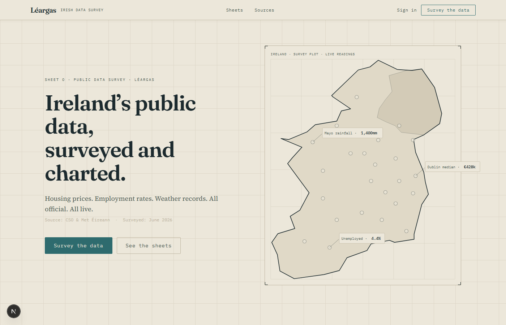

The front page. The big Ireland SVG is clickable and links through to the dashboard. Kept it minimal: a headline, a short description, and a clear call to action.

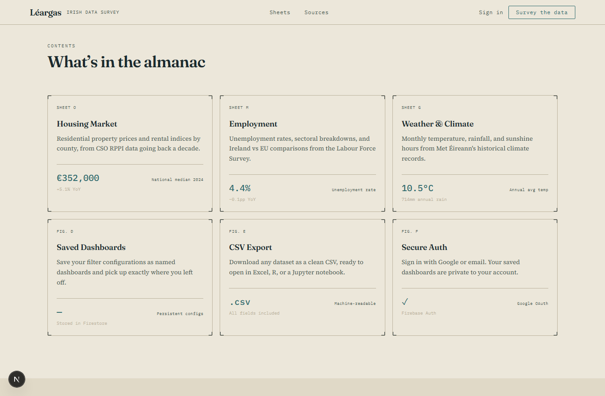

The three sections of the app laid out as cards below the fold. Each one describes what data source it draws from and what you can actually do with it.

---

### Dashboard - Overview

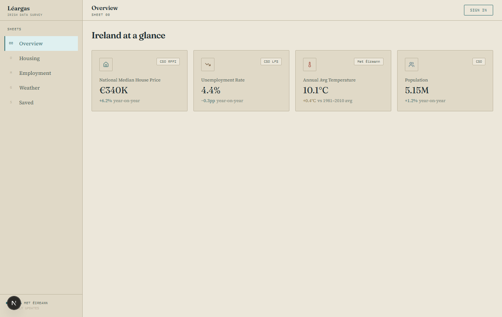

The first thing you see after logging in. Four headline numbers pulled from CSO and Met Éireann: median house price, unemployment rate, average temperature, and population. Clicking through on any of them takes you to the full breakdown.

---

### Dashboard - Housing

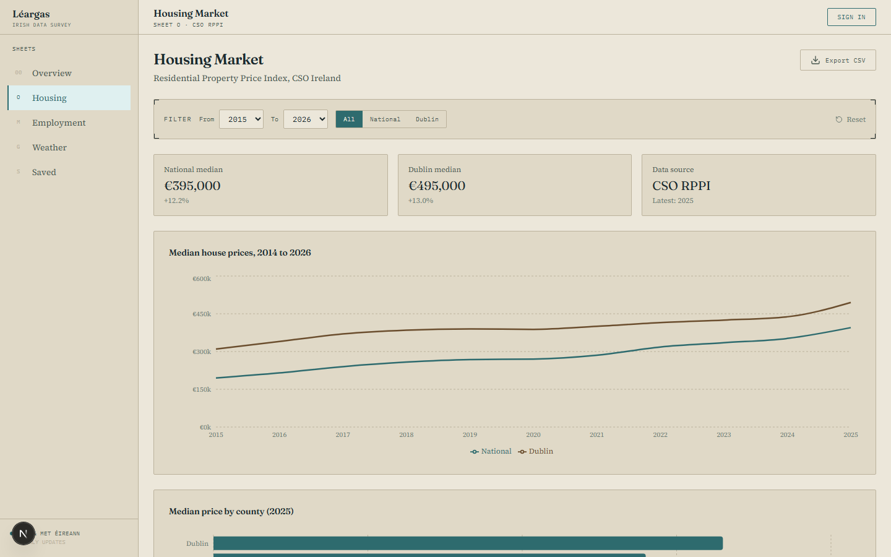

The housing sheet. You can filter by year range and switch between national vs Dublin figures. The top chart shows the price trend as a line, and the bar chart below ranks counties by median price for the latest year. There's a CSV export button in the top right if you want the raw numbers.

---

### Dashboard - Employment

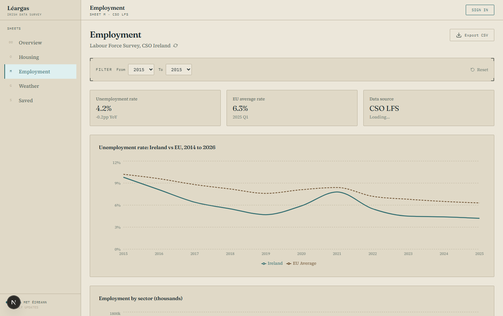

Employment data from the CSO Labour Force Survey. Shows the unemployment rate over time and breaks it down by sector. The filter strip lets you narrow the year range the same way as the housing sheet.

---

### Dashboard - Weather

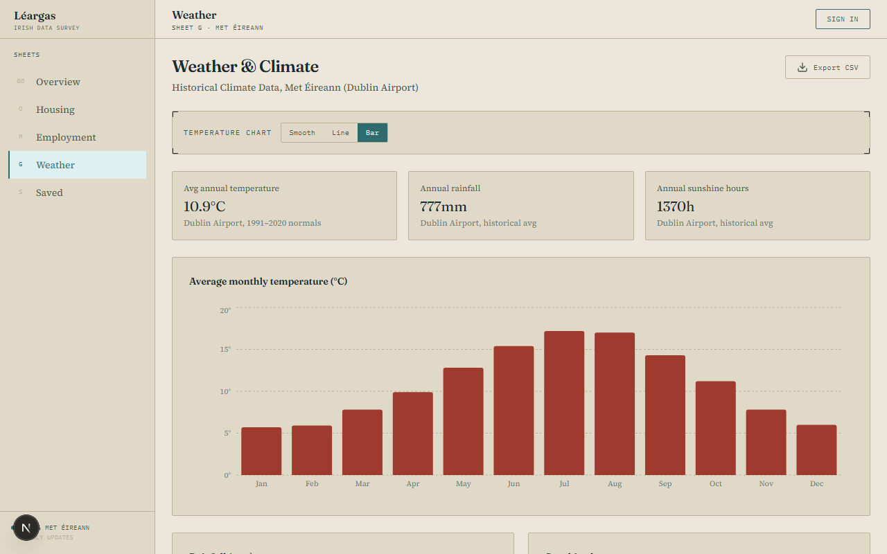

Met Éireann historical climate data for Dublin Airport. You can toggle the main temperature chart between area, line, and bar views using the buttons at the top. Rainfall and sunshine hours are shown side by side underneath.

---

### Sign in

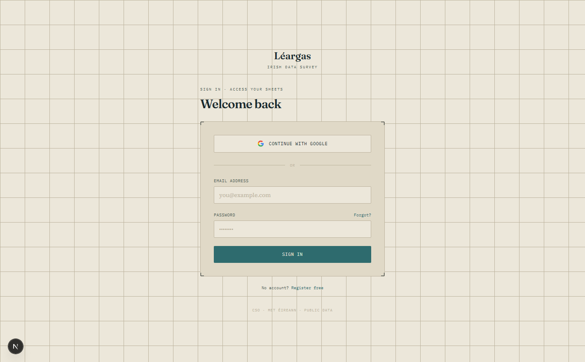

The login page. Email/password or Google. Nothing fancy, just trying to keep it consistent with the rest of the aesthetic rather than slapping in a default auth UI.

---

### Backend

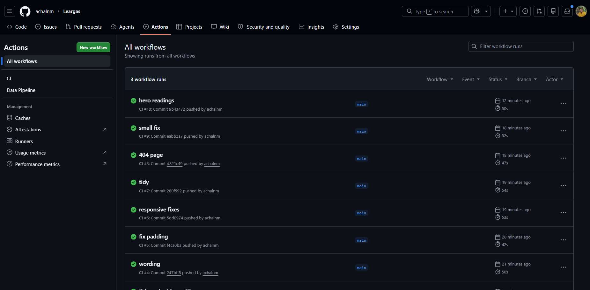

CI runs on every push via GitHub Actions. Typecheck, lint, and test all run in parallel. The workflow was broken on the first push (missing workspace flags) and fixed a commit later, which is why run #1 failed. Everything has been green since.

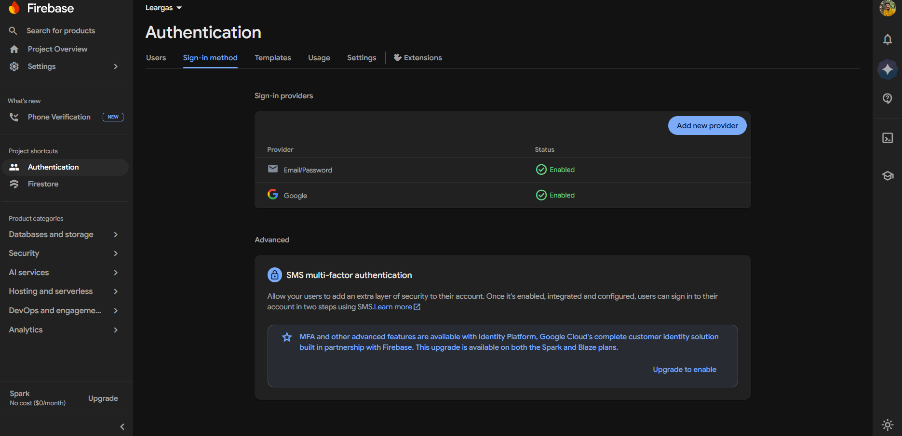

Firebase Authentication with Email/Password and Google OAuth both enabled. The app uses Next.js middleware to protect dashboard routes, so unauthenticated users get redirected to the login page.

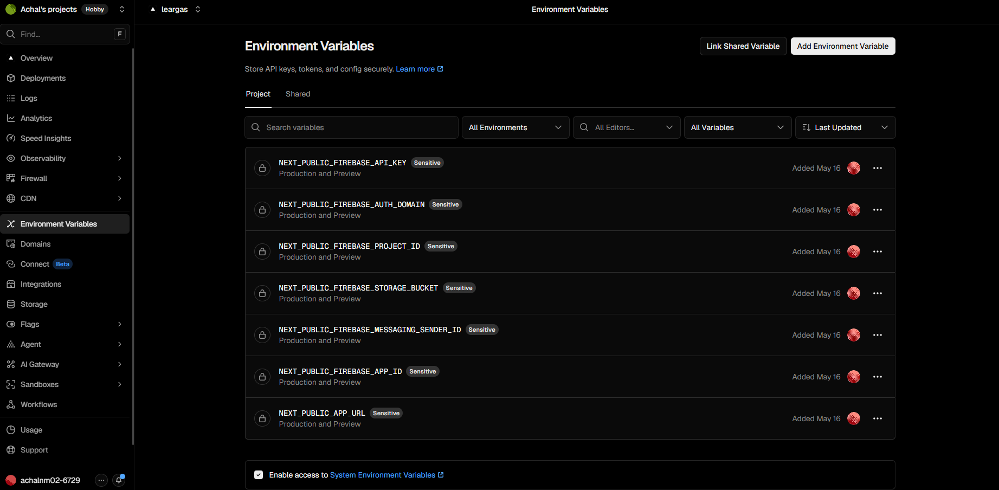

All seven Firebase config keys stored as sensitive environment variables in Vercel, added on May 16 when the project was first deployed. Values are hidden at rest and never committed to the repo.

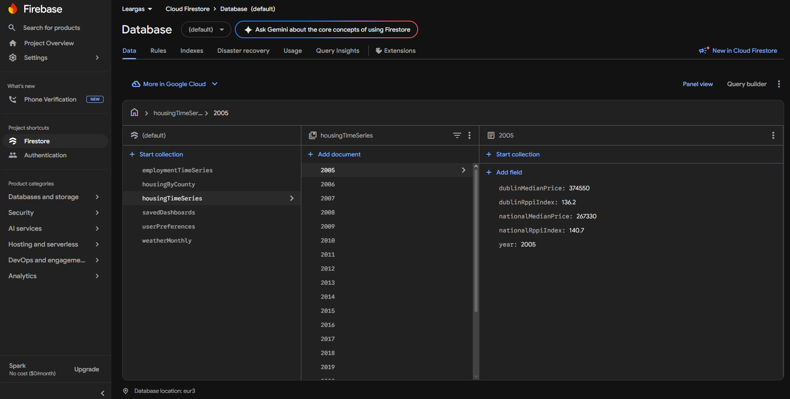

The Firestore database with all six collections. The housingTimeSeries collection shown here uses year as the document ID, each document holding national and Dublin median prices plus RPPI index values. Data goes back to 2005 and was loaded by the Python pipeline.

---

```text
Frontend              Backend / DB            Pipeline
------------------    --------------------    ----------------------
Next.js 16            Firebase Firestore       Python 3.11+
TypeScript (strict)   Firebase Auth           httpx
Tailwind CSS v4       Firebase Admin SDK      firebase-admin
Framer Motion         Next.js API routes      python-dotenv
Zustand
React Hook Form + Zod
Recharts
```

---

## Architecture


The Python pipeline runs on a GitHub Actions schedule every Monday. It fetches data from CSO and Met Éireann, cleans it, and pushes it to Firestore. The Next.js app reads from Firestore via server-side API routes.

---

## Why I built this

I'm completing an **MSc in Computing (Data Analytics)** and wanted a project that shows the full picture: not just the academic part (modelling, statistics, Python) but also production-grade engineering: type-safe TypeScript, CI/CD, real-time databases, OAuth, and a deployed product that non-technical people can use.

Ireland has excellent open data APIs (CSO, Met Éireann, data.gov.ie) but very few polished tools for exploring that data. Léargas fills that gap.

---

## Notes on the stack

**Firestore**: went with this over a relational DB because I didn't want to manage a Postgres instance for a read-heavy dashboard where the pipeline only writes once a week. Free tier covers it and there's nothing to configure.

**Next.js App Router**: server components let you fetch Firestore data before the page hits the browser, which helps with first load. Middleware auth protection was also straightforward.

**Recharts over D3**: tried D3 initially for the Ireland map, ended up writing the SVG by hand using a simple lon/lat projection to get county centroid positions. For standard line/bar/area charts Recharts is much less painful. D3 is probably the right call if I ever add a choropleth.

---

## Local development

### Prerequisites

- Node.js 20+
- Python 3.11+ (for data pipeline only)
- A Firebase project ([create one here](https://console.firebase.google.com))

### 1. Clone and install

```bash
git clone https://github.com/achalnm/leargas.git
cd leargas
npm install
```

### 2. Configure environment

```bash
cp .env.example apps/web/.env.local
# Open apps/web/.env.local and fill in your Firebase config keys
```

Get your Firebase config from:
`Firebase Console -> Project Settings -> General -> Your apps -> Web app -> Config`

### 3. Run the dev server

```bash
npm run dev
# -> http://localhost:3000
```

> Note: the dev script uses `--webpack` to avoid a Turbopack crash caused by the accented character in the project path. If you clone to a plain ASCII path you can remove that flag.

### 4. (Optional) Run the data pipeline

See [`packages/data-pipeline/README.md`](packages/data-pipeline/README.md) for full instructions.

```bash
cd packages/data-pipeline
pip install -r requirements.txt
python run_pipeline.py
```

---

## Deploying to Vercel

1. Push this repo to GitHub
2. Go to [vercel.com](https://vercel.com) -> New Project -> import your repo
3. Vercel auto-detects Next.js. Override build settings if needed:
   - Build command: `npm run build --workspace=apps/web`
   - Output directory: `apps/web/.next`
4. Add all environment variables from `.env.example` in the Vercel dashboard
5. Deploy. Every push to `main` deploys automatically.

---

## Firebase setup

1. Create a project at [console.firebase.google.com](https://console.firebase.google.com)
2. Enable **Authentication** -> Sign-in methods -> Email/Password + Google
3. Enable **Firestore Database** -> Start in production mode
4. Add the following Firestore security rules:

```js
rules_version = '2';
service cloud.firestore {
  match /databases/{database}/documents {
    match /housingTimeSeries/{doc} { allow read; }
    match /employmentTimeSeries/{doc} { allow read; }
    match /weatherMonthly/{doc} { allow read; }

    match /savedDashboards/{doc} {
      allow read, write: if request.auth != null
        && request.auth.uid == resource.data.userId;
      allow create: if request.auth != null;
    }
  }
}
```

1. For GitHub Actions, add your Firebase service account as a repo secret named `FIREBASE_SERVICE_ACCOUNT_JSON`.

---

## Project structure

```text
leargas/
├── .github/workflows/ci.yml          # CI: typecheck, lint, test
├── .github/workflows/data-pipeline.yml  # Weekly data refresh (Mondays)
├── docs/architecture.svg             # System architecture diagram
├── apps/web/                         # Next.js application
│   ├── app/
│   │   ├── (auth)/                   # Login, register, forgot-password pages
│   │   ├── dashboard/                # Dashboard pages and layout
│   │   └── api/data/                 # API routes (Firestore to client)
│   ├── components/
│   │   ├── auth/                     # LoginForm, RegisterForm
│   │   ├── dashboard/                # Sidebar, charts, dashboard views
│   │   └── landing/                  # Hero, Features, CTA sections
│   ├── lib/
│   │   ├── firebase/                 # Client and Admin SDK init, auth helpers
│   │   └── data/                     # Fetch and transform functions per module
│   ├── hooks/                        # useAuth, useFirestore, useDashboard
│   ├── store/                        # Zustand dashboard store
│   └── types/                        # Shared TypeScript interfaces
└── packages/data-pipeline/           # Python ETL pipeline
    ├── scrapers/                      # CSO and Met Eireann API fetchers
    ├── processors/                    # Data cleaning and transformation
    └── ingest/                        # Firestore push script
```

---

## Roadmap

- [ ] County-level map visualisation (D3.js choropleth)
- [ ] Dublin Bus route data overlay
- [ ] Planning permission application trends
- [ ] Email alerts for significant data changes
- [ ] Public API for Léargas data

---

## Licence

Data sourced from CSO Ireland, Met Éireann, and data.gov.ie under open government licence.
